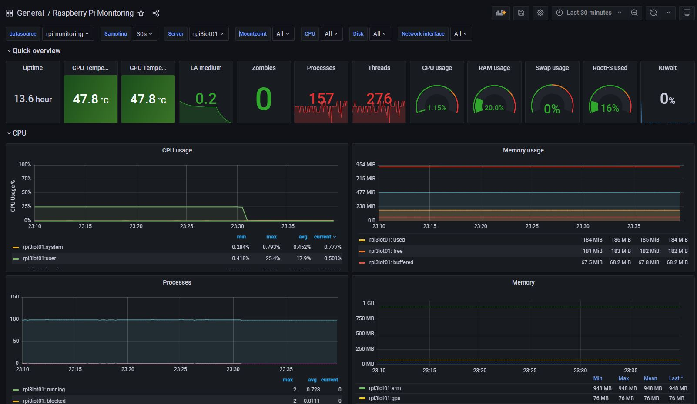

# telegraf
telegraf configuration inspired by :
- <a href="http://oostens.me/projects/raspberrypiserver/system-monitoring/" target="_blank">Oostens Nelis</a>
- <a href="https://github.com/fivesixzero/telegraf-pi-bash" target="_blank">Github - fivesixzero</a>
  
My database InfluxDB is : rpimonitoring  
  
  
# Grafana  
My adaptation to grafana Dashboard of https://grafana.com/grafana/dashboards/10578

# Result

